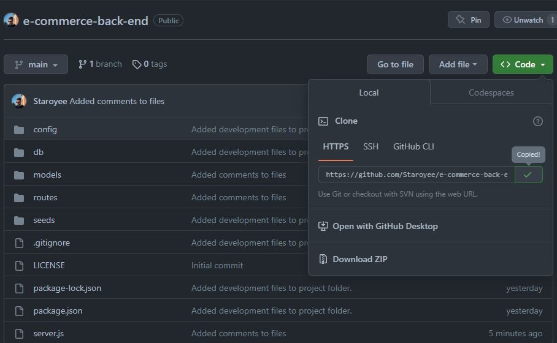

# E-Commerce-Back-End

## Description
I was tasked to create the back end of an E-Commerce website.

I was motivated to undertake this task because I wished to gain a greater understanding of MySQL databases, express.js, and Insomnia.

## Solve
The completion of this project provides the user with a functional back-end of an application to access, view, add to, and update a database using express.js.

## I have learned:
* How to use object oriented programming, and imporing/exporting modules.
* MySQL.
* Express.js
* Insomnia

## Installation
Steps to install this project on your local PC
1. Open the termal on your machine.
2. Use the terminal command `cd` to navigate to the directory where we want the repository located.
3. Locate the 'Code' button on the 'e-commerce-back-end' github repository, click it, then copy the 'HTTPS' link to clipboard. (See image)

4. Use the git command `git clone` followed by the URL copied from Github to clone the repo to our machine.
5. The `git clone` command creates a new directory with the same name as the repository. We navigate into our new directory using `cd`.
6. The repository should now be cloned onto your device and able to be edited in VScode or another editing software.
7. Install the NPM dependencies by opening the terminal in the index.js file and running the command 'npm i'.
8. Install MySQL and run the Schema.sql and Seeds.sql files in the CLI to add the databases to your system.

## Video Link
https://drive.google.com/file/d/1UyqMLpHPam2_CldQof_SfyceVd4snYyz/view?usp=sharing

## Instructions

To use the app:
1. Open the index.js file in the CLI
2. Run the schema.sql and seeds.sql files to create the database and seed it.
3. Run 'npm start' to start the server.
4. Open Insomnia and use the routes provided to manipulate the database.

## Credits
* Received tutor assistance.
* Week 12 activities.
* Week 13 activities.
* https://developer.mozilla.org/en-US/docs/Web/JavaScript/Reference/Classes
* https://sequelize.org/docs/v6/core-concepts/validations-and-constraints/
* https://sequelize.org/docs/v6/core-concepts/model-basics/
* https://sequelize.org/docs/v6/core-concepts/assocs/
